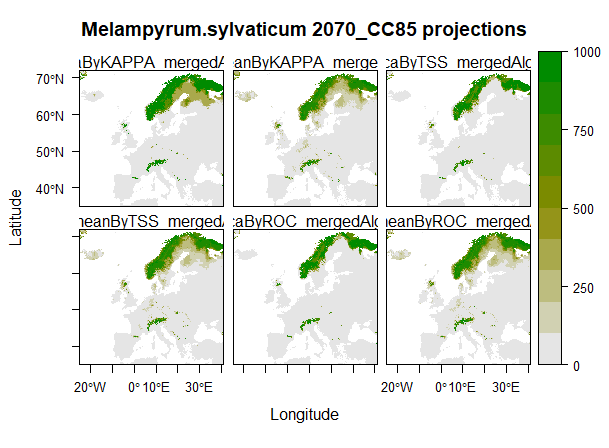

To find one highly annotated R script presenting biomod with all the necessary downloads and data prep ('All_purpose_biomod.R'), go to the Github link above. Branches will be created for specific species, regions and alternative climate data settings e.g. data resolution, RCP scenarios or downscaled global circulation models (GCMs).  Script can also be adapted to build other raster data into the ensemble models.  Other data prep stages to be added in the future e.g. thinning of distribution data.

Pull requests and revisions/adaptations welcome.

For the biomod2 package, please access the code directly from the CRAN repository:
Wilfried Thuiller, Damien Georges, Robin Engler and Frank Breiner (2016). biomod2:
  Ensemble Platform for Species Distribution Modeling. R package version 3.3-7.
  https://CRAN.R-project.org/package=biomod2

